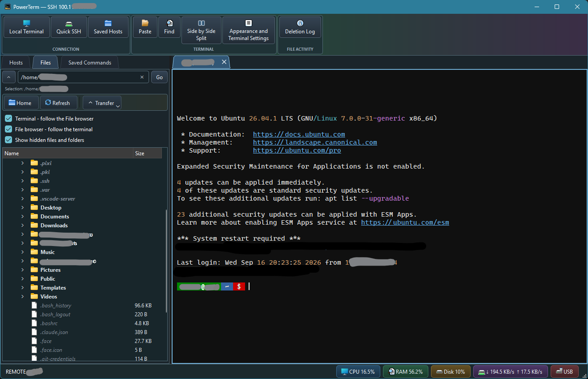

# PowerTerm

**Remote (SSH) terminals, and SCP/SFTP file management in one desktop application.**

[Releases](https://github.com/prab-s/powerterm/releases) · [User guide](USER_GUIDE.md) · [Licence](LICENSE)

Since this is a FOSS, cross-patform, replica (not clone) of MobaXterm, you can work with local and remote (SSH) shells, browse files beside your terminal, as well as keep hosts and frequently used commands close at hand.

Current doesn't support (but they're coming... sooner or later):
- Telnet
- Serial
- Bluetooth

X Server support is something I'm investigating, but don't hold your breath, it might not come...

Anyway. PowerTerm is written in Python/PySide6 with a lot of help from Codex.

## Download PowerTerm

Download the latest Windows and Linux packages from the
[PowerTerm Releases page](https://github.com/prab-s/powerterm/releases).

It's kind of like MobaXterm, but cross platform, and FOSS.

---

## What you can do

- **Work locally or over SSH** with tabbed sessions and a side-by-side split view.
- **Manage files alongside your terminal** using a local file browser or remote
  SFTP, with uploads, downloads, and a built-in text editor.
- **Keep navigation in sync** by letting the terminal follow the file browser,
  or the file browser follow the terminal.
- **Reuse hosts and commands** with saved SSH profiles and grouped saved commands.
- **Search terminal output and adjust its appearance**, including fonts and cursor settings.
- **Inspect system information** through CPU, memory, disk, network, and USB controls.

Settings and host profiles are stored in a per-user JSON configuration file.
Remembered passwords use the operating-system credential store through `keyring`
where available; they are not stored in that JSON file.

Choose **Local Terminal** to open a local shell, or **Quick SSH** to connect to a
remote machine. Use **Saved Hosts** for connections you want to reuse.

See the [user guide](USER_GUIDE.md) for terminal controls, file transfers,
[keyboard shortcuts](USER_GUIDE.md#useful-shortcuts), and
[where to find your configuration](USER_GUIDE.md#finding-the-configuration-file).

If you need to create your own package, the guided workflow is `scripts/build.py`.
Build details are in the [user guide](USER_GUIDE.md#build-setup-and-selection).

## Licence

PowerTerm is licensed under the **GNU General Public License, version 3**.
See [LICENSE](LICENSE) for the full terms.
